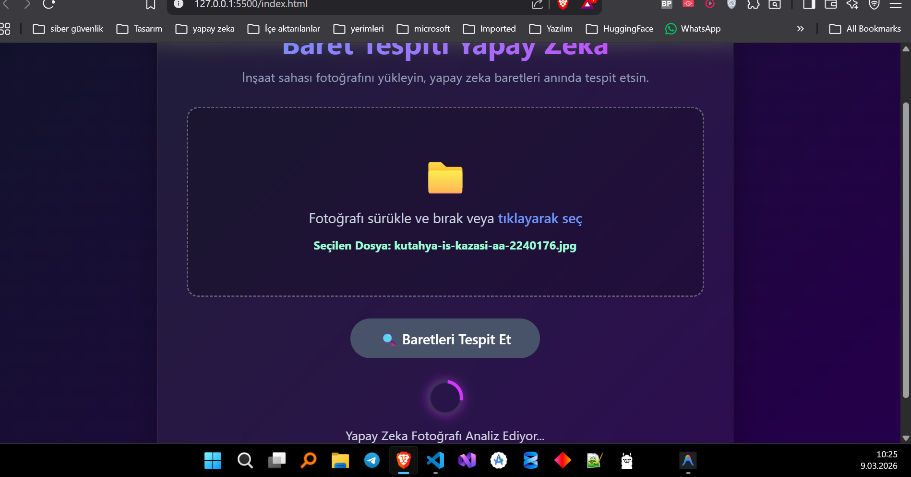
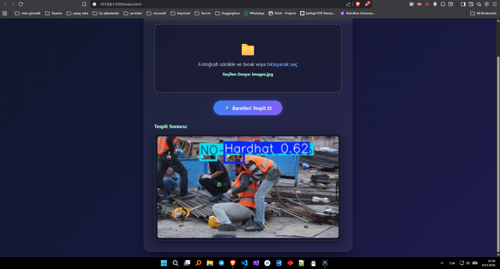
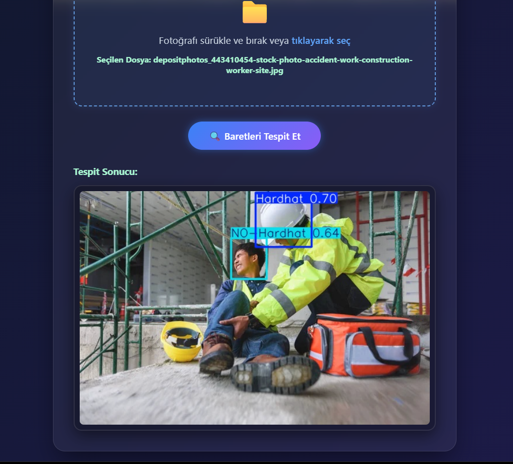

# Baret Tespiti Yapay Zeka

Insaat sahasi fotograflarinda baret kullanimini tespit eden, YOLO tabanli bir web uygulamasi.

## Proje Ozeti

Bu proje, kullanicidan alinan fotografi `FastAPI` backend'ine gonderir ve `best.pt` modeli ile:
- `Hardhat`
- `NO-Hardhat`

siniflarini tespit ederek kutucuklu sonuc gorselini tekrar arayuze dondurur.

## Ozellikler

- Surukle-birak veya tiklayarak goruntu yukleme
- Tek tikla analiz (`/predict` endpoint)
- Sonuc gorselini anlik gosterme
- Basit ve modern arayuz (HTML/CSS/JS)

## Veri Seti ve Egitim

- Veri seti kaynagi: `https://universe.roboflow.com/roboflow-universe-projects/hard-hats-fhbh5`
- Kullanilan surum: `dataset/6` (`resized640_noAugmentation-RF-DETR`)
- Toplam goruntu: `19,745`
- Train: `13,782` (`%70`)
- Valid: `3,962` (`%20`)
- Test: `2,001` (`%10`)
- Model egitimi: `Google Colab` ortaminda gerceklestirildi.

Not: Proje sayfasinda bazen yuvarlanmis olarak `20k images` gorunebilir; detayli surum sayisi `19,745` olarak gecmektedir.

## Proje Yapisi

```text
.
|- main.py               # FastAPI uygulamasi ve YOLO tahmin endpoint'i
|- index.html            # Arayuz
|- static/
|  |- style.css          # Arayuz stilleri
|  |- script.js          # Frontend is akisi
|- best.pt               # Egitilmis YOLO modeli
|- 1.png
|- 2.png
|- 3.png
```

## Kurulum

1. Ortami olusturun ve aktif edin:

```powershell
python -m venv .venv
.\.venv\Scripts\Activate.ps1
```

2. Gerekli paketleri yukleyin:

```powershell
pip install fastapi uvicorn ultralytics opencv-python numpy python-multipart
```

3. Uygulamayi baslatin:

```powershell
uvicorn main:app --reload
```

4. Tarayicida acin:

```text
http://127.0.0.1:8000
```

## Kullanim

1. Bir fotograf secin (veya surukleyip birakin).
2. `Baretleri Tespit Et` butonuna basin.
3. Islenmis sonucu ayni sayfada goruntuleyin.

## API

- `GET /` -> `index.html` arayuzunu dondurur.
- `POST /predict` -> Yuklenen goruntuyu isleyip sonuc gorselini `image/jpeg` olarak dondurur.

## Ekran Goruntuleri

### Arayuz - Yukleme Ekrani



### Ornek Sonuc 1



### Ornek Sonuc 2



## Notlar

- `best.pt` dosyasinin proje kok dizininde olmasi gerekir.
- Backend calismazsa frontend istekleri hata verir.